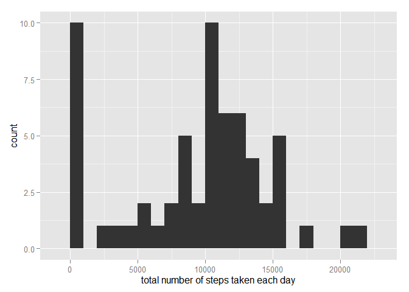
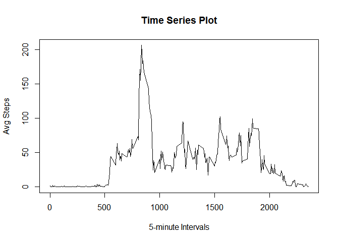
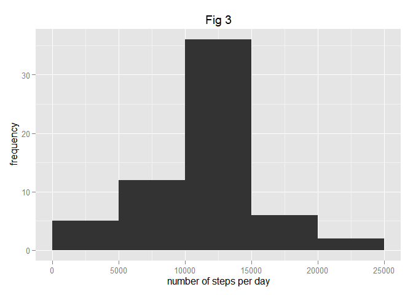
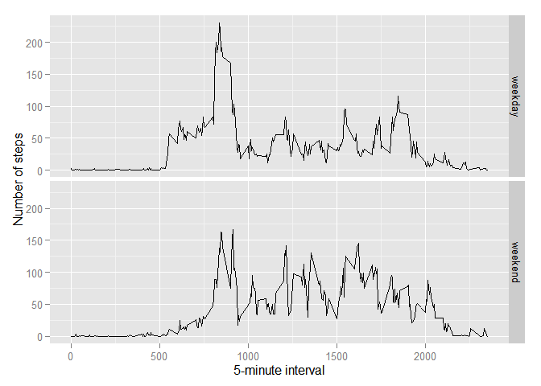

# Reproducible Research: Peer Assessment 1


## Loading and preprocessing the data


```r
data <-read.csv("activity.csv")
data$steps <- as.numeric(data$steps)
data$date <- as.Date(data$date)
```

## What is mean total number of steps taken per day?

```r
library(ggplot2)
suma <- tapply(data$steps, data$date, FUN=sum, na.rm=TRUE)
qplot(suma, binwidth=1000, xlab="total number of steps taken each day")
```

 

```r
mean(suma, na.rm=TRUE)
```

```
## [1] 9354.23
```

```r
median(suma, na.rm=TRUE)
```

```
## [1] 10395
```

## What is the average daily activity pattern?

```r
mediaPasos <- tapply(data$steps,data$interval,mean, na.rm=TRUE)
plot(names(mediaPasos), mediaPasos, type="l", main = "Time Series Plot", xlab="5-minute Intervals", ylab="Avg Steps")
```

 

```r
print(paste0("Interval ", as.numeric(names(which.max(mediaPasos))) , " with the maximum number of steps."))
```

```
## [1] "Interval 835 with the maximum number of steps."
```

## Imputing missing values


```r
print(paste0("Total number of missing values ", sum(is.na(data)) , " ."))
```

```
## [1] "Total number of missing values 2304 ."
```
The strategy to fill the na values will be the using the mean of the 5 mins intervale:

```r
by_interval <- aggregate(steps ~ interval, data = data, FUN = function(x) {
      mean(x, na.rm = TRUE)
  })

for (i in 1:length(data$steps)) {
    if (is.na(data[i, 1])) {
        
        ##  5-minute interval 
        steps_average <- subset(by_interval, by_interval$interval == as.numeric(data[i, 
            3]))$steps
        
      
        data[i, 1] <- steps_average
    } else {
        data[i, 1] <- data[i, 1]
    }
    data
}

head(data)
```

```
##       steps       date interval
## 1 1.7169811 2012-10-01        0
## 2 0.3396226 2012-10-01        5
## 3 0.1320755 2012-10-01       10
## 4 0.1509434 2012-10-01       15
## 5 0.0754717 2012-10-01       20
## 6 2.0943396 2012-10-01       25
```

```r
##Histogram 
library(ggplot2)
agdate <- aggregate(steps ~ date, data = data, sum)
ggplot(agdate, aes(steps)) + geom_histogram( 
    breaks = c(0, 5000, 10000, 15000, 20000, 25000)) + labs(y = expression("frequency")) + 
    labs(x = expression("number of steps per day")) + labs(title = expression("Fig 3"))
```

 

```r
suma <- tapply(data$steps, data$date, FUN=sum, na.rm=TRUE)
 
mean(suma, na.rm=TRUE)
```

```
## [1] 10766.19
```

```r
median(suma, na.rm=TRUE)
```

```
## [1] 10766.19
```
The mean and median have the same value now.

The daily number of steps is bigger.

## Are there differences in activity patterns between weekdays and weekends?

```r
nameDay <- function(date) {
    day <- weekdays(date)
    if (day %in% c("lunes", "martes", "miércoles", "jueves", "viernes"))
        return("weekday")
    else if (day %in% c("sábado", "domingo"))
        return("weekend")
    else
        return("weekday")
}
data$date <- as.Date(data$date)
data$day <- sapply(data$date, FUN=nameDay)

 

##plot

 averages <- aggregate(steps ~ interval + day, data=data, mean)
 
 ggplot(averages, aes(interval, steps)) + geom_line() + facet_grid(day ~ .) +
    xlab("5-minute interval") + ylab("Number of steps")
```

 
